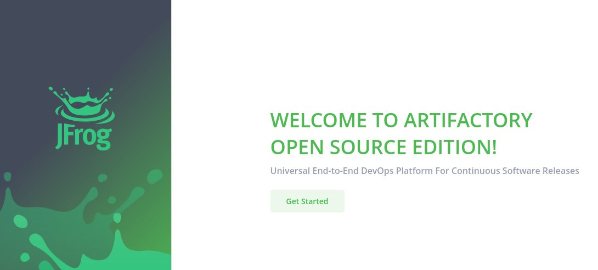
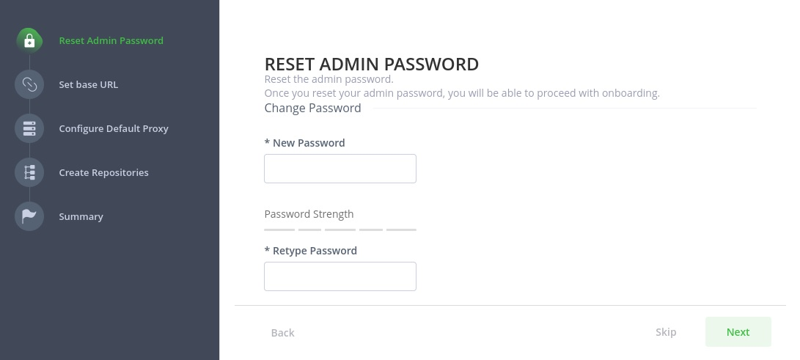
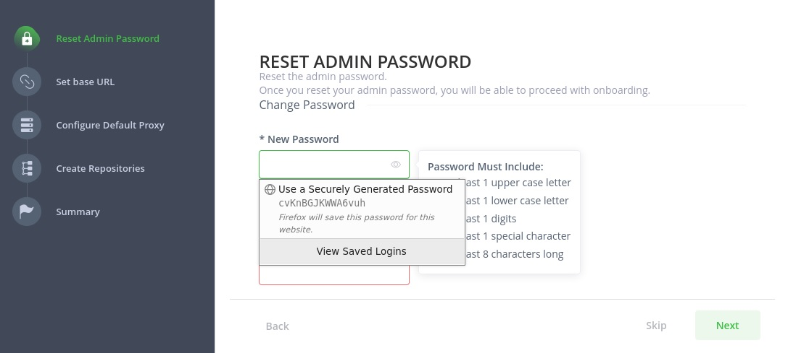
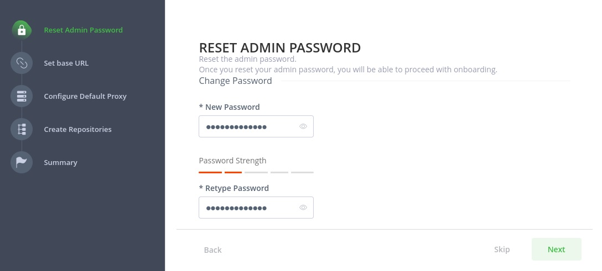
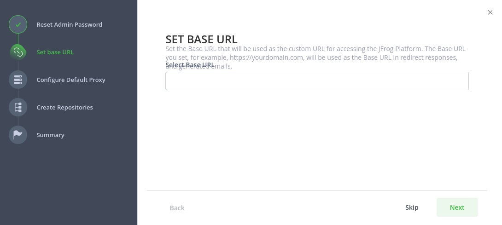
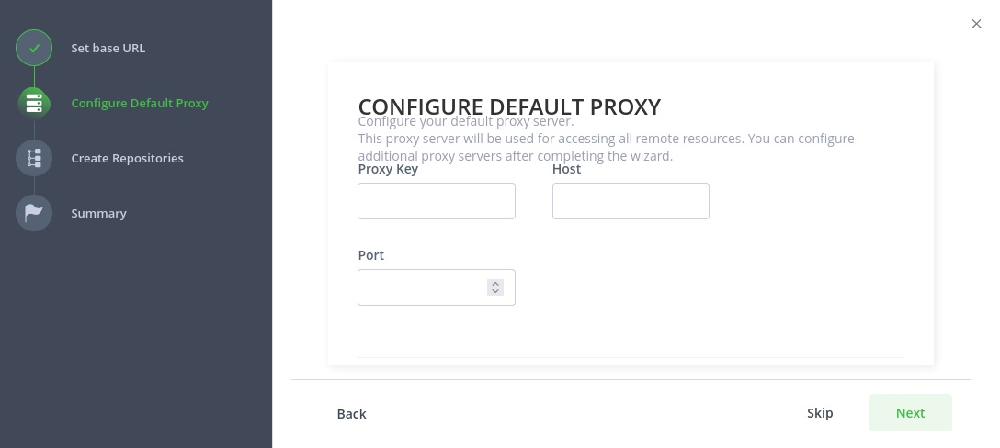
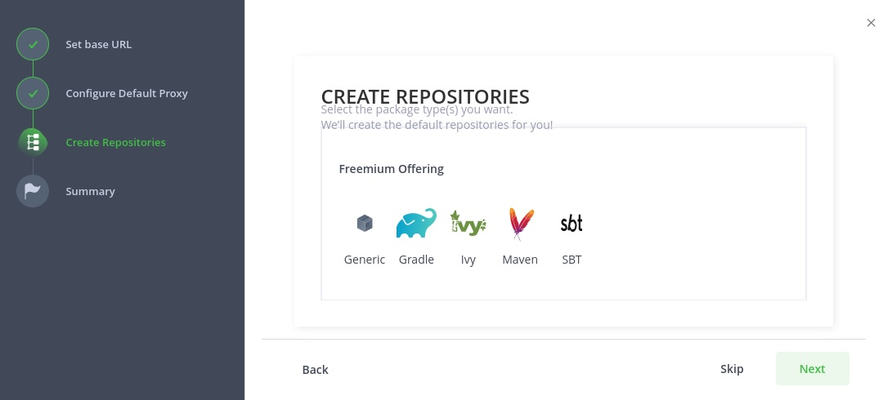
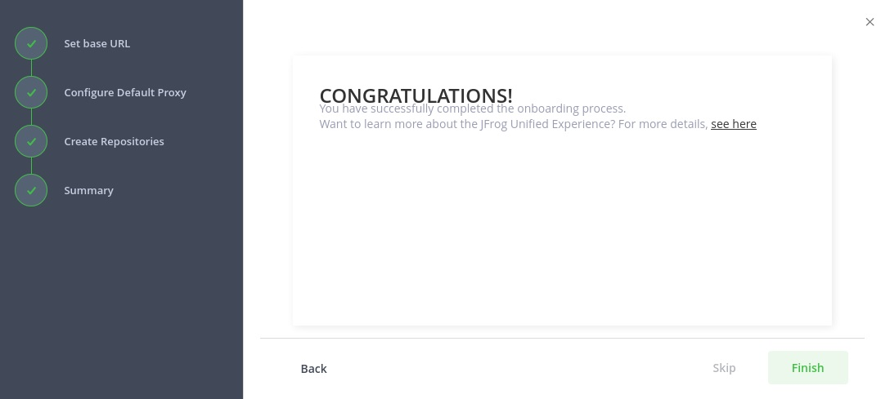
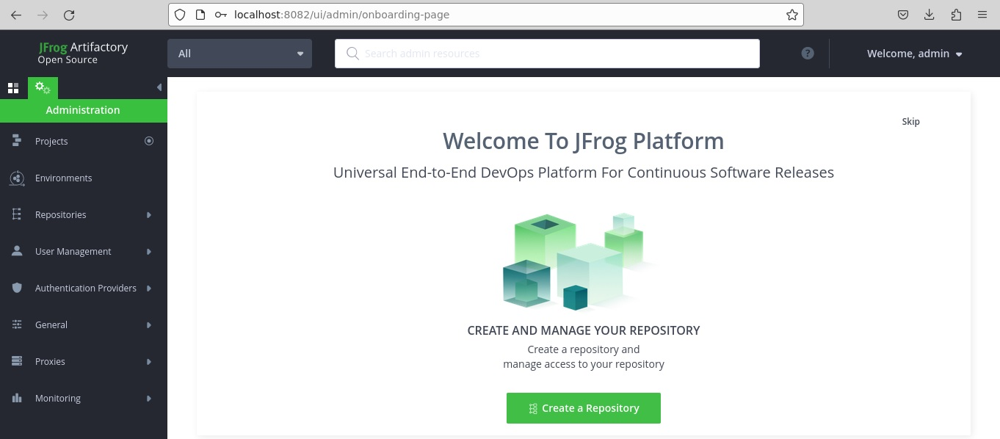

# JFrog Artifactory 

- Windows installation
- Docker installation
- Customize configuration 
- JFrog CLI
- Users and groups

---

Minimum System Requirements: **4 CPU**, **4 GB** Memory. 
External Ports: **8081**, **8082**.

---

Default username for the build-in administrator user: *admin* 
Default password for the build-in administrator user: *password*

---

Check service binding:
>ss -tunelp | grep 8081 
>ss -tunelp | grep 8082

---

### File structure:
/backup 
/bootstrap 
/data 
/etc 
/log 
/work 

---

**Welcome screen:** 

**Reset admin password:** 

**Set base URL:** 

**Configure default proxy:** 

**Create repositories:** 

**Finish:** 

**JFrog Platform welcome screen:** 

**HTTP Status 404 - Not Found:** 

